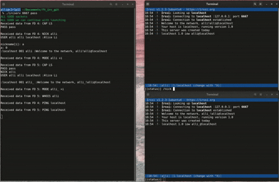

# Ft_irc



## Main overview
ft_irc is a project dedicated to building a custom IRC (Internet Relay Chat) server using C++. Its goal is to implement a fully functional IRC server that supports multiple client connections over TCP/IP, adhering to standard IRC protocols. Key features include user authentication, message routing, and channel management. The server has been developed and tested using the irssi client.

## Implemented features
The server is built to manage numerous client sessions at once, ensuring seamless interaction across users. It features secure access through password-based authentication and lets participants personalize their experience by choosing unique nicknames and usernames, as well as joining specific chat channels.

Direct messaging between users is supported, along with reliable message delivery across the network. The server also includes a suite of administrative tools for channel moderation, such as:

- **KICK**: Expels a user from a channel.
- **INVITE**: Grants access to a user by inviting them into a channel.
- **TOPIC**: Allows viewing or changing the subject of a channel.
- **MODE**: Configures various channel settings, including invite-only access, topic edit permissions, password protection, operator roles, and user capacity limits.

To maintain high performance, the system leverages non-blocking input/output operations and event-driven mechanisms like poll() to handle real-time network activity efficiently.

## Program Usage

For the best experience use Linux and have Irssi installed

1. Clone repository
```
https://github.com/SashaCHU-st/ft_irc.git
```
2. Move to directory
```
cd ft_irc
```
3. Compile the project
```
make
```

4. Run the server with 
```
./ircserv <port> <password>
```
5. For example
```
./ircserv 6667 helloworld
```

## For testing 
use nc to manually send commands
```
nc 127.0.0.1 6667
```
Next can use as real IRC, for example :
```
PASS helloworld
NICK test1
USER test1 0 * :Real Name
JOIN #channel
```
or

open new terminal
```
irssi -c 127.0.0.1 -p 2222 -w pass
```
```/quit``` to exit
  
## Trying different commands
- ```/nick <new nickname>``` change your nickname
- ```/join #<channel name>``` join a channel or create a new channel
- ```/msg <nickname of user>``` private message another 
user

When you're in a channel try these commands
- ```+k``` set/remove a channel key (password)
- ```+o``` give another user operator status
- ```+l``` set/remove the user limit to channel
- ```+t``` set/remove restrictions of topic to channel 
operators
- ```/topic <topic name>``` change or view channel topic
if you're an operator (+o)
- ```/kick <nickname>``` eject client from a channel
- ```/invite <nickname>```invite them to your channel